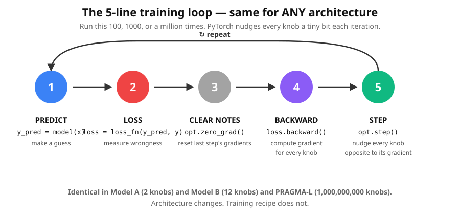
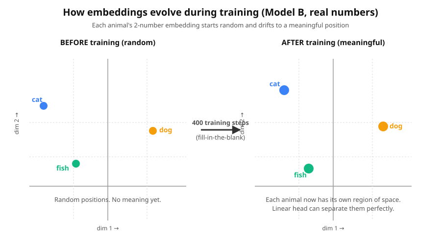

# Lesson 1b — Architecture vs. Training (read this between Lesson 1 and Lesson 2)

If after Lesson 1 you're wondering *"OK, but where exactly does the learning
happen in a Transformer? Is the embedding given or calculated? Is attention
learned?"* — this lesson is for you. It separates two ideas that are easy
to conflate.

## The two ideas, separated

*(Same training loop, different architectures — see the side-by-side network diagrams on the [L1b lesson page](html/lesson_01b.html).)*

There are **two completely separate things** in every neural network:

### 🏗️ Architecture — *what* the model computes

The math pipeline the model runs to turn input into output. Linear regression
is `y = w·x + b`. A Transformer is `embedding → attention → feed-forward →
output`. **Architecture is a choice you make when you design the model.**

Each layer in the architecture has its own **"weights"** (parameters with
`requires_grad=True`). Bigger architectures have more weights.

### 🎓 Training — *how* the weights get tuned

The universal "guess, measure, nudge" recipe from Lesson 1. **The same 5-line
loop trains ANY architecture** — PyTorch doesn't care if there are 2 parameters
or 2 billion.



## Why this matters

When we built Lesson 2's embedding table, the numbers were random — because
**we never ran the training loop on them**. The architecture was in place
(the table existed and the lookup worked), but no training happened, so the
weights stayed at random.

When we did Lesson 3's attention, again — we just showed the *mechanism*
and hand-fed it numbers. No training loop ran.

**In Lesson 4 we'll finally combine architecture (embedding + attention)
with training (the 5-line loop).** The training loop will nudge *every*
weight in the architecture — the embedding numbers, the attention matrices,
the output layer — all at once.

## Two tiny experiments to drive it home

Run these side-by-side. Same training recipe; different architectures.

### Model A — Linear regression (2 parameters)

```bash
python3 aside/model_A_linear.py
```

Architecture: `y = w·x + b`. Just a weight and a bias (`w` and `b`). Training nudges
them until they reach `2` and `1` (the secret rule was `y = 2x + 1`).

Output:
```
INITIAL PARAMS:   w = 0.000    b = 0.000

 step |       w |       b |     loss
----------------------------------------
    0 |   2.500 |   0.700 |  57.0000
   20 |   2.080 |   0.710 |   0.0158
  100 |   2.021 |   0.926 |   0.0010

FINAL PARAMS:     w = 2.021    b = 0.926
```

### Model B — Embedding + linear classifier (12 parameters)

```bash
python3 aside/model_B_embedding.py
```

Architecture: `word_id → embedding (2 numbers) → linear → sound scores`.
Twelve parameters: 6 in the embedding table + 6 in the linear head.

Output:
```
INITIAL EMBEDDING TABLE (random — meaningless):
  dog   -> [+1.54, -0.29]
  cat   -> [-2.18, +0.57]
  fish  -> [-1.08, -1.40]

FINAL EMBEDDING TABLE (after 400 training steps):
  dog   -> [+2.56, -0.21]
  cat   -> [-2.49, +1.64]
  fish  -> [-1.26, -2.35]

Predictions:  dog → bark ✓  cat → meow ✓  fish → swim ✓
```

### Watching the embeddings evolve

The 3 dots literally drift across the embedding space during training:



Each animal starts at a random spot. The training loop nudges it toward a
spot the linear head can correctly classify. Nobody designs the positions;
they emerge from playing the game.

## What changes between Model A, Model B, and a Transformer?

| | Architecture | Params | Loss |
|---|---|---|---|
| **Model A** | `y = w·x + b` | 2 | MSE |
| **Model B** | `id → embedding → linear` | 12 | Cross-entropy |
| **Lesson 4 (Transformer)** | `embedding → attention → FFN → output` | ~5,000 | Cross-entropy |
| **PRAGMA-Large** | (same as Lesson 4, much bigger) | 1,000,000,000 | Cross-entropy |

**The training loop is identical for all four.** `loss.backward()` computes
gradients for every weight, no matter how many; `opt.step()` nudges them all.

## TL;DR

- **Architecture says WHAT the model computes.** It defines the pipeline of
  math and how many weights there are.
- **Training says HOW the weights get tuned.** The same 5-line loop nudges any
  number of weights.
- **The embedding table is just one part of the architecture** — a layer with
  trainable weights that get nudged by gradient descent like any other layer.
- **Embeddings are LEARNED, not given.** They start random and the training
  loop shapes them.

When you understand this separation, the rest of the course (and modern AI
in general) clicks into place. Onward to [Lesson 2](02_walkthrough.md).
