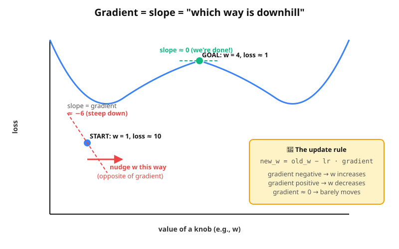

# Lesson 1c — Inside the training loop: loss and gradient descent

A deeper look at what `loss.backward()` and `opt.step()` actually do.
After this you'll never see them as "magic" again.

Companion script: [`aside/model_A_with_gradients.py`](aside/model_A_with_gradients.py)
Interactive visualisation: [`visuals/gradient_descent_interactive.html`](visuals/gradient_descent_interactive.html) — open it in any browser and click to drop the ball, then watch it roll downhill.

---

## Part 1 — How `loss` is computed (MSE in Model A)

In Model A we use **Mean Squared Error** (MSE):

```
1. for each example:  compute  (prediction − truth)
2. square it
3. take the average
```

Walking through **step 0** with the actual numbers:

At step 0, `w = 0` and `b = 0`. So the model predicts:
```
y_pred = w·x + b = 0·x + 0 = [0, 0, 0, 0, 0]
```

The truth is `y_true = 2x + 1 = [3, 5, 7, 9, 11]`.

| x | y_pred | y_true | error (pred − true) | error² |
|---|--------|--------|---------------------|--------|
| 1 | 0 | 3  | −3  | 9 |
| 2 | 0 | 5  | −5  | 25 |
| 3 | 0 | 7  | −7  | 49 |
| 4 | 0 | 9  | −9  | 81 |
| 5 | 0 | 11 | −11 | 121 |

Sum: `9 + 25 + 49 + 81 + 121 = 285`. Mean: `285 / 5 = 57`. ✓ matches the
program's output: `step 0 ... loss = 57.000`.

The squaring matters for two reasons:

1. **Removes signs.** Underestimating by 3 and overestimating by 3 are both
   "equally wrong" — but `−3` and `+3` would average to 0. Squaring fixes
   this.
2. **Punishes big mistakes more.** A mistake of size 10 contributes 100 to
   the loss; a mistake of size 1 contributes only 1. The model is pushed
   harder to fix big errors first.

---

## Part 2 — What "gradient descent" actually means

The loss is a single number. Each knob is a separate number. So the loss
is a **function of all the knobs**. For Model A with knobs `w` and `b`,
the loss is a function of those two values — a surface in 3D, like a hill:



> **The gradient is just the slope of that hill** — measured separately
> for each knob.

For knob `w`, the gradient answers:

> *"If I increase `w` by 1, by how much does the loss change?"*

Possible answers:

- **Gradient is +10** → increasing `w` increases loss by 10 per unit.
  We want loss to *go down*, so we should **decrease** `w`.
- **Gradient is −50** → increasing `w` decreases loss by 50 per unit.
  So we should **increase** `w`.
- **Gradient is ≈ 0** → flat ground. `w` is fine where it is.

That's where the update rule comes from:

```
new_w = old_w − learning_rate × gradient
```

The minus sign is the "go opposite to the gradient" part. The learning rate
controls step size.

---

## Part 3 — Computing the gradient by hand at step 0

For our specific loss `mean((w·x + b − y_true)²)`, the gradients work out
to:

```
gradient w.r.t. w  =  mean( 2 × error × x )
gradient w.r.t. b  =  mean( 2 × error )
```

At step 0 (`w = 0`, `b = 0`):

| x | error | 2 × error × x | 2 × error |
|---|----|-----|-----|
| 1 | −3  | −6   | −6  |
| 2 | −5  | −20  | −10 |
| 3 | −7  | −42  | −14 |
| 4 | −9  | −72  | −18 |
| 5 | −11 | −110 | −22 |

```
gradient_w  =  mean(−6, −20, −42, −72, −110)  =  −250 / 5  =  −50
gradient_b  =  mean(−6, −10, −14, −18, −22)   =  −70 / 5   =  −14
```

Both negative → increasing either knob will decrease loss → we should
increase both.

Applying the update rule with `lr = 0.05`:

```
new_w  =  0 − 0.05 × (−50)  =  +2.5
new_b  =  0 − 0.05 × (−14)  =  +0.7
```

Now compare to the program's actual output:

```
step    0 |  w = 2.500  |  b = 0.700
```

🎉 **Exact match.** PyTorch did exactly the arithmetic we just did by
hand. The library just automates the calculus so you don't have to write
the derivative formula yourself.

---

## Part 4 — See it for yourself

Run `model_A_with_gradients.py`:

```
step |    w   |    b   |  loss  | grad_w | grad_b | update_w | update_b
─────────────────────────────────────────────────────────────────────────
   0 | 0.000  | 0.000  | 57.000 | -50.00 | -14.00 |  +2.500  |  +0.700
   1 | 2.500  | 0.700  |  1.940 |  +9.20 |  +2.40 |  -0.460  |  -0.120
   2 | 2.040  | 0.580  |  0.093 |  -1.64 |  -0.60 |  +0.082  |  +0.030
   3 | 2.122  | 0.610  |  0.030 |  +0.34 |  -0.05 |  -0.017  |  +0.002
   ...
```

Read down the table and notice:

1. **Step 0**: big negative gradients → big positive updates. `w` shoots from 0 → 2.5.
2. **Step 1**: gradients are now small positives — we *overshot*! Pulls back slightly.
3. **Steps 2+**: gradients are tiny and bouncing around zero. The ball is at the bottom of the hill, settling in.

> **The gradient shrinks as we approach the right answer**, because the
> hill flattens out near the bottom. That's why training naturally slows
> as it converges.

---

## Part 5 — The interactive version

Open [`visuals/gradient_descent_interactive.html`](visuals/gradient_descent_interactive.html)
in your browser. The page shows:

- A 2D heatmap of the loss landscape — red = high loss, green = low loss.
- A blue ball: the current `(w, b)`.
- A blue arrow showing the nudge direction (opposite of the gradient).
- A green target at the right answer (`w=2, b=1`).
- Red trail showing the path the ball has taken.

**Things to try with your son:**

1. Click **Step** to take one training step. Watch the ball move toward the green target.
2. Click **Run** and watch it roll.
3. Click somewhere far away to drop the ball. Run — does it still find the target?
4. Crank the **learning rate slider** to ~0.2. Now the ball *overshoots* and bounces
   around. Crank it past 0.25 and it might diverge entirely.
5. Set the learning rate to ~0.001. Now the ball barely moves — too small a step.

> **The learning rate is the single most important hyperparameter in deep
> learning.** Too small: training takes forever. Too big: the model
> oscillates or blows up. Real ML practitioners spend a lot of time tuning
> it.

---

## Part 6 — How this generalises to bigger models

In Model A, PyTorch tracked **2 gradients**.
In Model B, PyTorch tracked **12 gradients**.
In Lesson 4's Transformer, PyTorch will track **thousands of gradients**.
In PRAGMA-Large, it tracks **1,000,000,000 gradients** per step.

Same `loss.backward()` call. Same `opt.step()` call. Just more numbers.

This is the magic of **automatic differentiation** (autograd): you write
the *forward* computation (predict + loss), and PyTorch computes the
*backward* gradients automatically using the chain rule. You never have
to derive a single derivative.

That's it. That's the whole engine that powers modern AI.

---

## Three things to remember

> 1. **Loss** is one number that measures how wrong the model is on a batch.
> 2. **Gradient** of the loss with respect to a knob = "which way does that knob need to move to lower the loss?"
> 3. **Gradient descent** = "nudge every knob opposite to its gradient, a tiny bit, repeat thousands of times."

When you say *"PyTorch does the gradient descent"*, you now know it's
literally doing the arithmetic in Part 3 for every knob in the model,
automatically.
