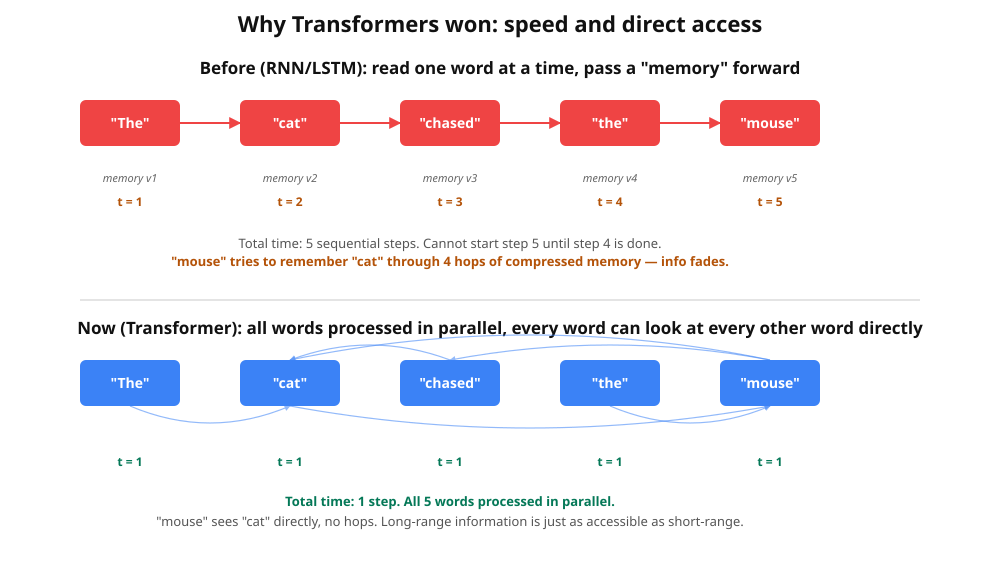
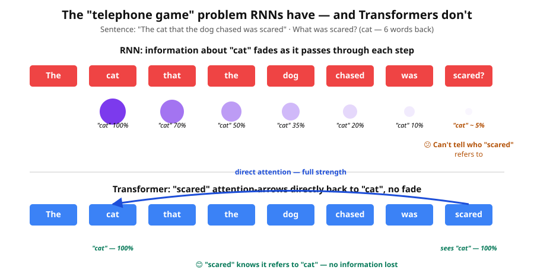
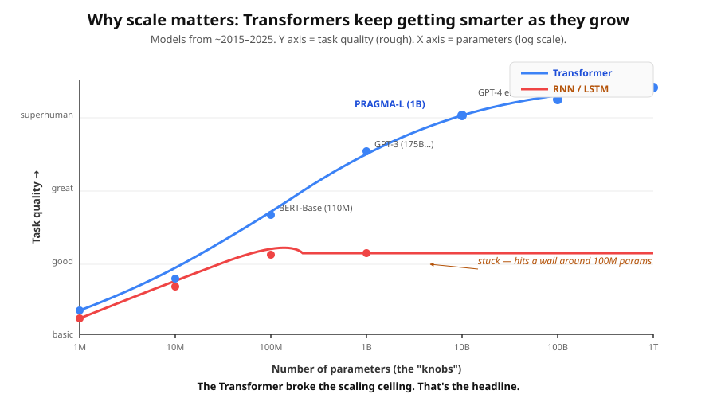

# Lesson 3b — Why Transformers won

A short detour before Lesson 4 to answer the obvious question: *"OK, attention
is clever — but what did people use BEFORE? And why is attention such a big deal?"*

By the end of this lesson you'll be able to explain to anyone, in plain
English, why the 2017 Transformer paper (*"Attention Is All You Need"*) is
considered one of the most important results in AI history.

---

## What came before: RNNs

Before Transformers, the dominant tool for sequences (sentences, time series,
banking events) was the **Recurrent Neural Network** — *RNN*, or its fancier
cousin the **LSTM**.

### How an RNN works (in one sentence)

It reads the sequence **one word at a time** and updates a single "memory
note" at every step. The memory note is supposed to carry all the relevant
context from earlier words.

**Index-card analogy**: imagine reading a book using only one index card.
You can only write what fits on the card. For every new word you read,
you erase the card and rewrite it to include the new information. By the
end of a long chapter, almost none of the early details survive on the
card — they got crowded out.

That's an RNN.

### What an RNN does *not* do

- It does **not** look at all the words at once.
- It does **not** let later words look back at earlier words directly.
- The earlier a word appeared, the more "diluted" its information becomes
  by the time you process the last word.

---

## The Transformer fixes everything an RNN got wrong

Three problems, three fixes.

### Problem 1: RNNs are sequential → SLOW

An RNN must finish processing word 1 before it can start word 2. Word 2
before word 3. And so on. **A 100-word sentence = 100 steps you cannot
parallelise.**

This was tolerable when sentences were short and GPUs were small. But it
became the bottleneck once people wanted to train on the entire internet.

**Transformer fix:** **parallelism**. Attention lets the model process
all 100 words *simultaneously* — one big matrix multiplication instead
of 100 little ones. On a modern GPU, that's literally 100× faster (often
more), because GPUs love big parallel matrix math.

> 🧠 **Tell your son:** *"With RNNs, the computer is like one person reading
> a book one word at a time. With Transformers, it's like 100 people each
> reading one word at the same time, then shouting their findings to each
> other. That's why ChatGPT can read your whole prompt in a flash."*

### Problem 2: RNNs lose long-range information → SHORT MEMORY

The "single index card" problem. Information about a word fades as it
passes through more update steps.

Try this sentence: *"The cat that the dog chased was scared."* What was
scared? The **cat** — but "cat" is 6 words back. An RNN trying to predict
what "scared" refers to is reading through a card that's been rewritten
6 times. The information about "cat" is mostly gone.

**Transformer fix:** **direct access**. With attention, when the word
"scared" is being processed, it can put 90% of its attention budget
*directly* on "cat" — across 6 words, with no information loss. The
distance doesn't matter. A word at position 100 has the same access to
position 1 as it does to position 99.

This single fix unlocked:
- Better understanding of long documents.
- Accurate translation of long sentences.
- Code completion across thousands of lines.
- And, for PRAGMA, **understanding banking event histories that span years**.

### Problem 3: RNNs don't scale → STUCK AT MODEST SIZES

RNNs hit a wall around ~100 million parameters. Beyond that, adding more
parameters didn't reliably make them smarter. Two big reasons:

1. **Vanishing gradients across time.** When you train an RNN on a long
   sequence, the gradient signal from the last word has to travel back
   through every intermediate step. Multiply small numbers together long
   enough and they vanish — early-word knobs get effectively no learning
   signal.
2. **Sequential compute can't be GPU-accelerated.** Bigger model + already
   slow = unbearably slow.

**Transformer fix:** **scalability.** Because attention is parallel and
every word has direct access to every other word, gradients flow cleanly
through any sequence length. **Transformers just keep getting better as
you make them bigger.**

The plot above (rough, illustrative — but the trend is real) shows the
single biggest practical reason Transformers won. RNNs flatten out at
~100M parameters; Transformers scale to **a trillion** and counting.

> 🧠 **Tell your son:** *"The whole 'AI explosion' of the last few years —
> ChatGPT, image generators, all of it — is essentially this scaling curve.
> Transformers scale. The old architectures didn't. Bigger = smarter,
> and we keep finding 'bigger'."*

---

## The combined superpower: foundation models

These three fixes together unlocked something even bigger: **foundation
models**.

When you can:
- Train on enormous amounts of data (because parallel = fast),
- Capture long-range patterns (because direct attention = no fade), and
- Scale to billions of parameters (because gradients flow cleanly),

…then a **single model** can absorb so much general knowledge that you
can reuse it for many different tasks with just a small bit of fine-tuning
on top. That's the *foundation model* idea: pre-train once on the internet,
adapt many times.

This is exactly what PRAGMA does for Revolut — pre-train once on 24 billion
banking events, adapt to credit scoring, fraud detection, lifetime value
prediction, etc. **No prior architecture made this practical.**

---

## A concrete number to remember

Roughly:

- **2018 BERT (Transformer)** — pre-trained on Wikipedia + books in days.
  Beat every prior model on every language task.
- **2018 LSTM (best of its generation)** — would have needed weeks to train
  on the same data, and would still have lost.

**Same task. Same data. Just a different architecture choice.** That's
what made the field jump.

---

## TL;DR

> 1. **Speed.** Transformers process all tokens in parallel; RNNs process them one at a time. → GPU acceleration becomes possible.
> 2. **Memory.** Attention gives every token direct access to every other token; RNNs squeeze everything through a fixed memory bottleneck.
> 3. **Scale.** Because of (1) and (2), Transformers can be made bigger and bigger and keep getting smarter. RNNs hit a ceiling.

The same three superpowers explain why ChatGPT exists, why image
generators exist, and why PRAGMA can replace dozens of hand-crafted
models with one. **Attention isn't just a clever idea — it's the trick
that finally let neural nets scale.**

Now back to [Lesson 4](04_transformer_and_mlm.py), where we'll combine
everything and watch a tiny Transformer actually train.
