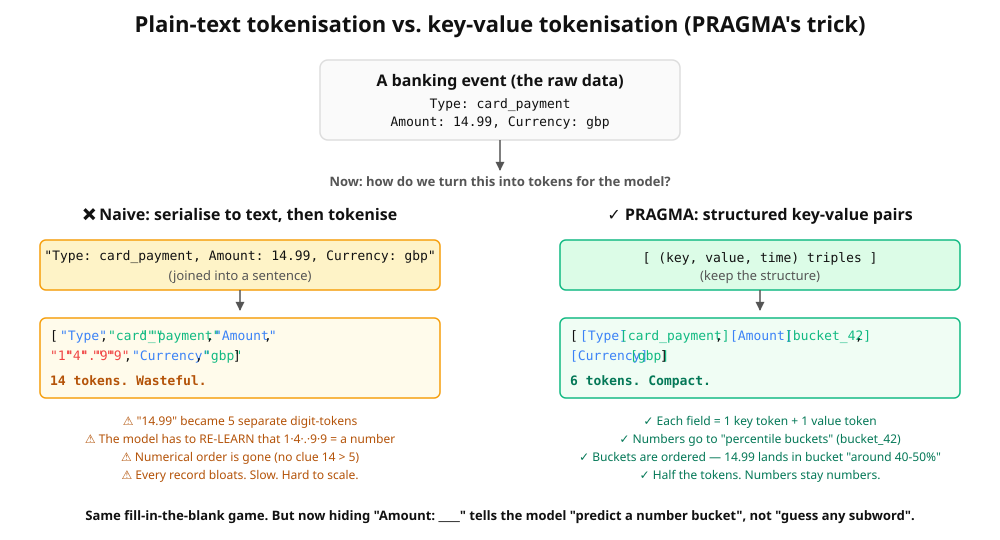
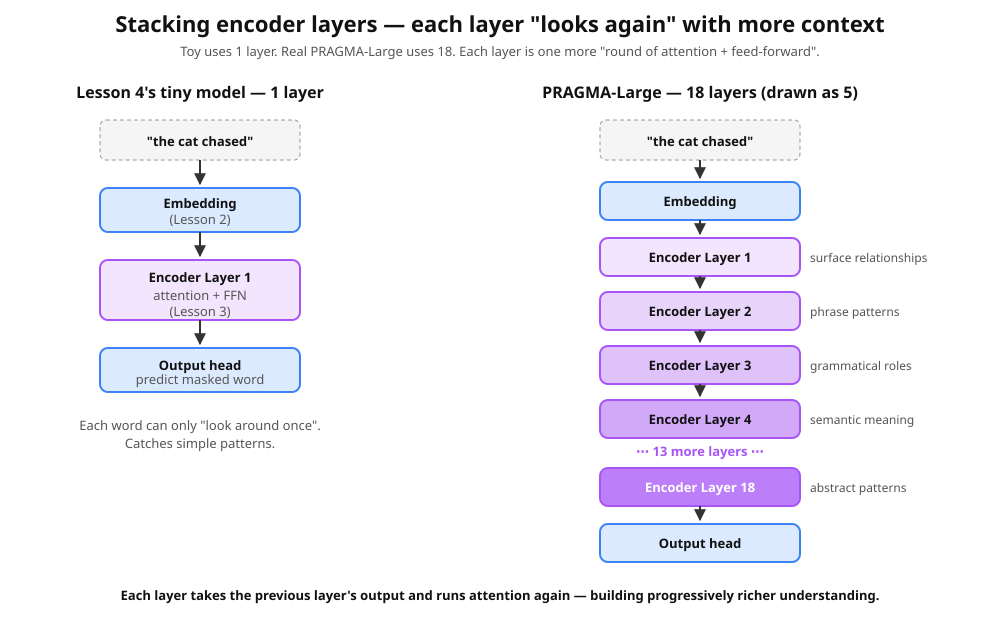

# Lesson 5 — Putting it all together (`pragma_mini.py` line by line)

Open [`../pragma_mini.py`](../pragma_mini.py) next to this file. You're going
to re-read every single line — but now you should be able to point at each
one and say which prior lesson it comes from. The repetition is the point:
each time you see an idea reused, the intuition gets stronger.

## 🧰 Lesson reference legend

We'll tag every important line with the lesson concept it uses:

- **L1** — the 5-line training loop (predict → loss → backward → step)
- **L1b** — architecture vs. training
- **L1c** — gradient descent details
- **L2** — tokens & embeddings
- **L3** — attention
- **L3b** — why Transformers won
- **L4** — masked language modelling (fill-in-the-blank)

---

## Section 1 — Vocabulary (L2)

```python
KEYS   = ["pet", "action", "place"]
VALUES = ["dog", "cat", "fish",
          "eat", "sleep", "play",
          "garden", "couch", "bowl"]

PAD, MASK = "<pad>", "<mask>"
vocab = [PAD, MASK] + KEYS + VALUES
tok2id = {t: i for i, t in enumerate(vocab)}
V = len(vocab)
```

> **L2 in action.** A vocabulary list (14 tokens), and a dict that maps
> each token to its integer ID. Standard tokenisation — exactly the same
> setup as Lesson 2's pet/sound vocab.

The new twist: tokens fall into two groups.

- **KEYS** are field names ("what kind of fact am I about to tell you?").
- **VALUES** are the actual contents.

This is the *key-value tokenisation* PRAGMA uses for structured data:



Banking data isn't free text — it's `Type: card_payment, Amount: 14.99`.
If you serialised that into a sentence and let a regular tokeniser chop
it up, you'd waste tokens AND destroy the numbers (`14.99` → `1`, `4`,
`.`, `9`, `9`). Keeping the key-value structure means each field is just
one key token + one value token. Cleaner, faster, more accurate.

In our toy: `("pet", "dog")` becomes two tokens. Real PRAGMA does the
same with `("Type", "card_payment")` and `("Amount", "bucket_42")`.

---

## Section 2 — Synthetic data (the secret rules)

```python
RULES = {
    "dog":  {"action": ["eat", "play"],   "place": ["garden", "bowl"]},
    "cat":  {"action": ["sleep", "play"], "place": ["couch", "bowl"]},
    "fish": {"action": ["eat", "sleep"],  "place": ["bowl"]},
}

def random_event():
    pet = random.choice(list(RULES))
    act = random.choice(RULES[pet]["action"])
    plc = random.choice(RULES[pet]["place"])
    return [("pet", pet), ("action", act), ("place", plc)]
```

> Plain Python — no ML yet. We define the **hidden patterns** the model
> will discover from training. The model never sees `RULES` directly. It
> only sees events that obey them, and has to back out the structure.

Notice: dogs play in the garden, fish only go in the bowl, etc. After
training, the model will refuse to guess "dog is sleeping on the couch"
because no such event ever existed in its training data.

---

## Section 3 — Encoding an event (L2)

```python
def encode(event):
    ids = []
    for k, v in event:
        ids.append(tok2id[k])
        ids.append(tok2id[v])
    return ids
```

> **L2 in action.** Turn an event into a flat list of token IDs.
>
> `[("pet","dog"), ("action","eat"), ("place","garden")]` becomes
> `[pet_id, dog_id, action_id, eat_id, place_id, garden_id]` →
> e.g., `[2, 5, 3, 8, 4, 11]`.

The order matters: key, value, key, value, …. The model will pick up
that pattern from positional embeddings (added below).

---

## Section 4 — Masking (L4)

```python
def mask(ids, p=0.25):
    ids = list(ids)
    labels = [-100] * len(ids)              # -100 = "don't score this position"
    for i, t in enumerate(ids):
        if vocab[t] in KEYS:                # keep field names visible
            continue
        if random.random() < p:
            labels[i] = t                   # remember the truth
            ids[i] = tok2id[MASK]           # hide the value
    return ids, labels
```

> **L4 in action.** The fill-in-the-blank game. For each value token
> (not key tokens — we want to keep the field name as a hint), flip a
> 25% coin. If it lands heads: remember what the token was (`labels[i]
> = t`), then erase it (`ids[i] = MASK_ID`).
>
> `labels[i] = -100` for unmasked positions tells the loss function
> "don't grade this position" — we only score the model on the holes
> we made.

This is exactly **L4's mechanism**, applied here. The only twist is
"key tokens are never masked", because the field name is the prompt:
*"hide the Amount value, but tell the model the blank is supposed to
be an Amount"*.

---

## Section 5 — The architecture (L1b + L2 + L3 + L3b)

```python
class PragmaMini(nn.Module):
    def __init__(self, V, d=32, heads=2, layers=2):
        super().__init__()
        self.emb = nn.Embedding(V, d)                                  # (a)
        self.pos = nn.Embedding(64, d)                                 # (b)
        layer = nn.TransformerEncoderLayer(d, heads, 64, batch_first=True)
        self.enc = nn.TransformerEncoder(layer, layers)                # (c)
        self.head = nn.Linear(d, V)                                    # (d)
    def forward(self, x):
        positions = torch.arange(x.size(1), device=x.device)
        h = self.enc(self.emb(x) + self.pos(positions))                # (e)
        return self.head(h)                                            # (f)
```

This is **the whole Transformer**, in 6 lines. Let's tag every piece.

> 🧰 **Concept bridge — every piece traced to its origin lesson**
>
> | PragmaMini component | Origin |
> |---|---|
> | `nn.Embedding(V, d)` | **[L2](02_walkthrough.md)** — token → vector |
> | `nn.Embedding(64, d)` (positional) | (positional encoding — added during this lesson) |
> | `nn.TransformerEncoderLayer` (attention) | **[L3](03_walkthrough.md)** — Q/K/V + softmax |
> | `nn.TransformerEncoderLayer` (feed-forward) | **[L1.5 Step 7.5](notebooks/lesson_01_5_from_linear_to_neural.ipynb)** — Linear → GELU → Linear |
> | `nn.TransformerEncoderLayer` (LayerNorm + residual) | **[L4e](04e_encoder_layer_from_scratch.py)** — full breakdown |
> | `nn.TransformerEncoder(layer, layers=2)` — stacking | **[L1.5 Step 7.6](notebooks/lesson_01_5_from_linear_to_neural.ipynb)** — why depth matters |
> | `nn.Linear(d, V)` (output head) | **[L1](01_walkthrough.md)** — linear projection |
>
> No new concepts. Just composition.

### (a) `self.emb = nn.Embedding(V, d)`
> **L2 in action.** The embedding table. `V` rows (one per vocab word),
> `d=32` columns. **14 × 32 = 448 knobs**, all trainable.

### (b) `self.pos = nn.Embedding(64, d)`
> Position embedding — like word embeddings, but for *positions*.
> Position 0 has its own 32-number vector; position 1 has another, etc.
> Without these, attention has no idea which word came first vs. last.
> Up to 64 positions supported.

### (c) `self.enc = nn.TransformerEncoder(layer, layers)`
> **L3 in action — but stacked.** Each `TransformerEncoderLayer` is one
> round of attention + feed-forward (the worked example from L3). We
> stack **2 of them**. Real PRAGMA-Large stacks **18**.



Why stacking helps: each layer takes the previous layer's output and
runs attention on it *again*. The first layer mixes raw embeddings —
surface relationships. The second mixes the already-context-aware
vectors — richer patterns. With 18 layers, the model can build very
abstract understanding before it has to make a prediction.

> **L3b context.** This kind of stacking is feasible *because* of
> attention's parallelism — RNNs couldn't be stacked this deep without
> training time exploding.

### (d) `self.head = nn.Linear(d, V)`
> **The MLM head.** Takes each context-aware 32-d vector and projects
> it back to `V=14` scores — one per vocab word. The model's "guess"
> for a masked position is the word with the highest score.
>
> **L1b context.** Just another set of trainable knobs (`d × V = 448`
> here). The training loop will nudge these too.

### (e) The forward pass — embedding + position + encoders
```python
h = self.enc(self.emb(x) + self.pos(positions))
```
> Three things happen in this line:
> 1. `self.emb(x)` — look up each token's embedding (L2)
> 2. `+ self.pos(positions)` — add each position's embedding (so the model knows order)
> 3. `self.enc(...)` — run the result through both encoder layers in sequence (L3)

### (f) `return self.head(h)`
> Project the final vectors back to vocab scores. Output shape:
> `(batch, sequence_length, vocab_size)`.

**Total knobs in this model:** the embedding (448) + position (2048) + two encoder layers (~few thousand) + the head (448). All trainable.

> **L1b in action.** This is the architecture — what the math is.
> Training will nudge every one of those numbers via the L1 loop.

---

## Section 6 — Training (L1, L1c, L4)

```python
model   = PragmaMini(V)
opt     = torch.optim.AdamW(model.parameters(), lr=3e-3)
loss_fn = nn.CrossEntropyLoss(ignore_index=-100)

print("Training...")
for step in range(2000):
    batch = [random_event() for _ in range(32)]
    masked, labels = zip(*[mask(encode(e)) for e in batch])
    x = torch.tensor(masked)
    y = torch.tensor(labels)
    logits = model(x)
    loss = loss_fn(logits.reshape(-1, V), y.reshape(-1))
    opt.zero_grad(); loss.backward(); opt.step()
```

> **L1 + L1c + L4 in action.**
> - `AdamW` — a fancier optimiser than SGD. Still does gradient descent
>   (still the same 5-line loop), just with smarter step sizes per knob.
> - `CrossEntropyLoss(ignore_index=-100)` — measures wrongness when
>   picking 1 of `V` words. The `-100` tells it to skip positions we
>   didn't mask. (We saw why in §4.)
> - The loop:
>   - Make 32 random events (L4 data generation).
>   - Mask each one (L4 game).
>   - Stack them into tensors `x` (inputs) and `y` (answers).
>   - `model(x)` → `logits` (L1: predict).
>   - `loss_fn(...)` → loss (L1: measure wrongness).
>   - `opt.zero_grad(); loss.backward(); opt.step()` — the THREE LINES
>     OF MACHINE LEARNING (L1, L1c).

**This loop is identical in shape to Lesson 1's `w = w - lr × grad_w`.**
The only difference is that `loss.backward()` is now nudging *thousands*
of knobs across the embedding table, position embeddings, attention
matrices, FFN matrices, and output head — all at once.

---

## Section 7 — Inference (just `forward` with one example)

```python
def guess(event, hide_key):
    ids = encode(event)
    pos = None
    for i in range(0, len(ids), 2):
        if vocab[ids[i]] == hide_key:
            pos = i + 1
            ids[pos] = tok2id[MASK]
    with torch.no_grad():
        logits = model(torch.tensor([ids]))
    return vocab[logits[0, pos].argmax().item()]
```

> No new ideas — just runs the trained model on a single event with
> one field masked, then reads the model's top guess for that position.
>
> `torch.no_grad()` says "we're not training; don't bother tracking
> gradients". Saves memory and time at inference.

---

## What "real PRAGMA" adds on top

The paper makes the same recipe **bigger, smarter, and tuned for production**.

### 1. Smarter tokenisation by value type (§2.2)

Already covered above: numerical values get bucketed by percentile,
categorical values are single tokens, text uses BPE subwords. **Why?**
Banking values are heterogeneous and you can't tokenise them all the
same way without losing information.

### 2. Time encoding (§2.2 Temporal Information)

Every event has a timestamp. PRAGMA encodes time **two ways**:
- **Log-seconds since the previous event** — compresses huge gaps
  (years) while preserving precision for recent activity (seconds).
- **Calendar features** — hour-of-day, day-of-week, day-of-month, each
  encoded with sine/cosine of the angle around its cycle. Lets the
  model learn cyclical patterns (Friday-night spending, monthly
  salaries, etc.).

We skipped this entirely in `pragma_mini.py` — adding it would be a
fun stretch exercise.

### 3. Three encoders instead of one (§2.3)

Real PRAGMA splits the architecture into:
- **Profile State Encoder** — static info (region, plan, balance bucket).
- **Event Encoder** — encodes each event independently.
- **History Encoder** — looks across the whole sequence of events.

Each is its own bidirectional Transformer. Our toy does it all with one.

### 4. Depth (1 layer → 18 layers)

| Model | `d_model` | Encoder layers (P/E/H) | Heads | Total parameters |
|---|---|---|---|---|
| Our toy | 32 | – / 2 / – | 2 | ~5,000 |
| PRAGMA-S | 192 | 1 / 5 / 2 | 3 | 10 M |
| PRAGMA-M | 512 | 3 / 16 / 6 | 8 | 100 M |
| PRAGMA-L | 1024 | 9 / 45 / 18 | 16 | **1 B** |

PRAGMA-L stacks 18 history-encoder layers. Each layer is one more
round of attention + feed-forward — each one builds richer context
than the layer below. See the diagram in Section 5.

### 5. Smarter masking strategies (§2.3.5)

Three kinds mixed:
- **Token-level (15%)** — like our toy.
- **Event-level (10%)** — hide a whole event, force cross-event reasoning.
- **Key-level (10%)** — pick a key (e.g., "Amount") and hide all its
  values everywhere; the model has to predict each from surrounding context.

### 6. Downstream adaptation (§3.1)

After pre-training:
- **Embedding probe** — freeze the encoder, slap a tiny linear classifier
  on top. Fast, cheap.
- **LoRA fine-tuning** — tune ~2-4% of the weights via low-rank
  adapters. Better results.

Our [capstone](06_capstone.md) does the embedding-probe version.

### 7. Engineering (§2.4)

Sequence packing, dynamic batching, truncation, mixed-precision training,
32× NVIDIA H100 GPUs for two weeks of wall time. None of this changes
the model — but you can't train a billion-parameter model without it.

---

## Where you are now

```
✅ L1   — training loop
✅ L1b  — architecture vs training
✅ L1c  — gradient descent details
✅ L2   — tokens & embeddings
✅ L3   — attention
✅ L3b  — why Transformers won
✅ L4   — masked language modelling
✅ L5   — you understand pragma_mini.py end to end
```

You can now point at any line in `pragma_mini.py` and explain it.

Next, see one more **realistic** worked example before the capstone:
[Lesson 5b — Streaming churn predictor](05b_streaming_churn.md).
Same recipe, applied to a non-toy use case.
