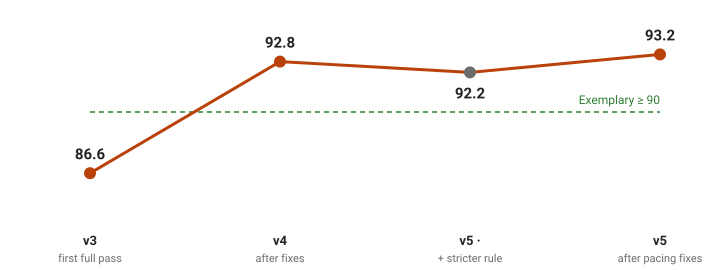
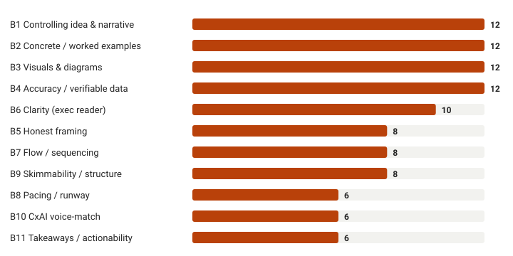

# How to build agentically... How We Let an AI Build a Course — and a Rubric Keep It Honest

*Why the method, not the model, is what made an AI-written curriculum worth shipping*

A coding agent wrote a [thirteen-lesson course on how Transformers work](https://fernfant.github.io/mini-pragma/course/html/index.html) — the real machinery behind BERT, GPT, and Revolut's PRAGMA — pitched at a curious thirteen-year-old. It did it fast. Static HTML, no build step, interactive widgets, a running example carried from "a computer can't read, it only does math on numbers" all the way to a fine-tuned model. Impressive. Then came the uncomfortable question, the one every team shipping AI-generated content eventually has to answer out loud:

**Is it any good?**

Not "does it run." Not "does it look finished." Is it *honest*, is it *clear*, would a kid actually learn from it — and how would we know, across thirteen pages, without simply reading each one and nodding along? That question is the whole story. Because the thing that made this course defensible wasn't the model that wrote it. It was the method we wrapped around the model. This is that method.

## The bet: learn by doing, taught by a machine

What we set out to build was deliberately narrow. A self-contained, interactive, no-build static-HTML course that teaches a bright 12–14-year-old how Transformers actually work — starting from arithmetic, ending at a working classifier — with no calculus, no linear algebra, and no jargon assumed. The house bet is one line: **you learn more in 30 seconds of playing than 5 minutes of reading.** Every page has something to click, drag, slide, or run. A page that is all prose is, by our own rule, a *failing* page.

That bet matters here because it's exactly the kind of standard an AI writer will quietly violate. Models love prose. They will happily generate four tidy paragraphs explaining attention and call it a lesson. Holding the line against that — page after page — is not a writing problem. It's a *measurement* problem.

## Structure is a product decision, not a table of contents

Before a single lesson, we fixed the shape. The course is **one linear spine of thirteen steps**: text → ids → vectors → attention → a guess → fine-tuning. The same example sentence transforms across lessons, so the reader sees continuity instead of a new toy each time. Pagination is reciprocal — every page's *Next* matches the following page's *Prev* — so nobody falls off the path. Genuinely optional material (side-quests, code walkthroughs) is reachable but kept *off* the spine, clearly labelled, never blocking the main route.

This sounds like housekeeping. It isn't. The spine is what lets you say "step 7 builds on step 6" and mean it — and it's what lets a reviewer, human or machine, check that claim mechanically. A wandering course can't be graded. A spine can.

## The real product was the rubric

Here is the part nobody warns you about: when your writer is an agent, **the writer is not the bottleneck. The grader is.**

So we wrote the grader first. Two artifacts sit upstream of every lesson. The **principles doc** says what a good page *is* — concrete before abstract, every term earned before it's named, analogies that don't have to be un-learned later, every cited number traceable to the companion code. And a **scored rubric** turns those principles into something you can argue with: each page scored 0–5 on a set of weighted criteria, summed to a single number out of 100, with explicit bands (90+ exemplary, 75–89 strong, and down).

Here is the actual instrument. Every one of the thirteen pages is scored **0–5 on eleven criteria**, each weighted, summed to a single number out of 100:

| # | Criterion | Weight | A 5/5 page… |
|---|-----------|:-----:|-------------|
| 1 | **Interactivity** | 12 | has real click/drag/slide/run widgets — and *predicts before it reveals* at the key moment |
| 2 | **Age-appropriate clarity** | 9 | plain second-person voice; every term earned; a 12–14-year-old follows unaided |
| 3 | **Concrete-first** | 9 | opens with real worked numbers; one idea per step; generalises only after |
| 4a | **Numeric accuracy** | 8 | every cited figure matches the companion code — or is labelled *illustrative* |
| 4b | **Honest framing** | 6 | simplifications flagged in-clause; no analogy you must later un-learn |
| 5 | **Narrative continuity** | 8 | re-uses the one running example; connects back and forward along the spine |
| 6 | **Reinforcement** | 8 | inline checks + recap + quiz that test *understanding*, not recall |
| 7 | **Structural correctness** | 8 | right nav pills, spinebar step/width, reciprocal pagination |
| 8 | **Technical soundness** | 8 | all inline JS passes `node --check`; valid data; no external deps |
| 9 | **Accessibility** | 8 | widgets keyboard-operable; every figure has words; colour never the sole signal |
| 10 | **Flow / sequencing** | 8 | reads top-to-bottom *once*, no backtracking; nothing used before it's defined |
| 11 | **Pacing / runway** | 8 | each new concept gets plain idea → name → micro-example → use |

Weights sum to exactly 100, on purpose — every point a fix earns has to come from somewhere. (And that last row, **Pacing**, was *not* in the first draft of the rubric. It's the one a human added later — and adding it is where this story gets interesting. Hold that thought.) The single most important design choice in the whole project was this: **we built the scoring rubric before we trusted the writer.** The rubric is the source of truth. The lessons are just the current best attempt to satisfy it.

If your team is shipping AI-generated anything and you don't have this artifact — the explicit, weighted definition of "good" that exists *independently* of the output — you don't have a quality process. You have vibes and a fast typist.

## The loop: score → fix → re-score

With a grader in hand, the work stops being "write a course" and becomes a loop — and the loop has a name: **score → fix → re-score.** Read all thirteen pages cold, score every criterion against the rubric, rank the pages *worst-first*, fix the lowest-scoring failures, then score again. Repeat until the number stops moving.

This is where building *agentically* earns its keep, because the loop is tedious in exactly the way an agent doesn't mind. The arc is in the audit reports, and every page's current score is live on the [scorecard](https://fernfant.github.io/mini-pragma/course/html/scorecard.html), so you can check our marking. The first full audit (v3) averaged **86.6** — five pages exemplary, eight merely strong.

Then came the iteration that mattered. The agent ran a single batch of roughly **forty targeted fixes across all thirteen pages at once** (tracked as tasks #59–#71). Each one aimed at a specific low score — not "make it better," but an instruction with coordinates. *L5 claims the toy model has ~5,000 parameters; it has ~20,000 — fix the number. L5b labels its recall figures "illustrative"; run the notebook and use the real ones.* Re-scored, the average climbed to **92.8**, nine pages now exemplary. Same model, same writer — the gain came entirely from grading what it produced and feeding the worst scores back in.

And the *audits* were agentic too. For the pacing pass that came later, **three read-only audit agents ran in parallel**, each re-reading all thirteen pages hunting for one failure mode and reporting back the exact spots. No human re-reads thirteen lessons three times looking for a single kind of mistake. An agent does it before lunch — and that asymmetry is the whole reason the loop is cheap enough to run again, and again.

That's the mechanism most "AI writes your content" demos skip. The first draft is never the product. **The loop is the product**, and the rubric is what closes it.

## The moves that make learning stick

Two house techniques carry most of the pedagogical weight, and both are things the rubric explicitly rewards.

The first is **predict-before-reveal.** Before showing any result, the page asks the reader to guess. The "🤔 good guess — here's what actually happens" beat is where understanding lodges, and when two pages tie in score, the one with a genuine prediction at the key moment ranks higher. It's the course's signature move, and it's baked into the grader so the agent can't forget it. (Keep it in mind — a few paragraphs from now, we're going to use it on *you*.)

The second is the **honest-failure arc** — "it got worse, here's why." When a change makes accuracy *drop*, we teach the drop instead of hiding it. A real attention regression in one lesson is presented as a regression, then explained. This is a pedagogical choice, but it's also the project's ethic, and — as you're about to see — we held ourselves to it too.

## The agent doesn't get bored. That's the asset and the risk.

There's a reason this method works better with a machine than it ever did with a tired human team: **the agent doesn't get bored.** It will re-read all thirteen pages on the eleventh pass with exactly as much care as the first. It will touch fifteen files to fix one cross-reference. The maintenance burden that kills human-run quality processes — the bookkeeping, the consistency checks, the "did we update that everywhere" — costs the agent almost nothing.

That's the asset. The risk is the same sentence read the other way: an agent that never gets bored also never gets *suspicious*. It won't wrinkle its nose at a number that smells wrong. So we made suspicion mechanical. Every cited figure must trace to the companion notebook — the recall and precision numbers in the [streaming-churn lesson](https://fernfant.github.io/mini-pragma/course/html/lesson_05b.html) are computed, not asserted. Every inline script must pass `node --check`. Every widget must be keyboard-operable with visible focus; every figure must carry a text equivalent. Verification isn't a final step. It's a gate the loop runs through every time.

## When a stricter ruler makes the score go down

And now the wrinkle — because a flawless arc would be exactly the kind of dishonesty this course was built to avoid.

A human read the course and said something the rubric, in all its ten-criteria precision, had missed: *concepts are introduced too fast.* Not wrong, not out of order, not unclear sentence-by-sentence — just named and used in the same breath, with no micro-example in between. None of the existing criteria caught it. So we added an eleventh, **C11 Pacing**, defined tightly: does each genuinely new, load-bearing concept get real runway — *plain idea → name → micro-example → use* — or does it land all at once?

We carved C11's eight points out of the most over-weighted criteria (interactivity dropped from 16 to 12) so the total still summed to 100. Then we re-scored.

> **🤔 Predict before you read on.** A stricter eleventh criterion has just been added to the rubric. The thirteen pages haven't changed — only the ruler has. So what happened to the average score: up, down, or flat?
>
> *Take the guess. The course makes thirteen-year-olds commit to an answer before the reveal; an executive can manage the same.*

If you guessed **down**, you've internalised the whole point of this post. The average **fell** — to **92.2** — because the new, stricter ruler immediately found nine pages with a real pacing gap. (And that guess you just made? That was *predict-before-reveal*. You've now taken the course.)

That drop is the most honest number in the whole project. It's what a sharper standard is *supposed* to do: surface problems the old standard was blind to. We found the nine spots, fixed each one, and re-scored a final time to **93.2**, nine pages exemplary again. Here's one of those fixes, in full:

> **Worked example — a pacing fix, before and after**
>
> *Before (named in passing):* the lesson listed the nonlinearities — "ReLU, GELU, softmax" — and moved on. A thirteen-year-old just met *softmax* and watched it leave the room.
>
> *After (named, then shown):* softmax turns a list of scores into probabilities. Feed it `[2, 1, 0]` and it returns `[0.66, 0.24, 0.10]` — three numbers that now sum to 1. *Then* we name it.
>
> Same concept, same spot in the lesson. That edit is the entire difference between **C11 = 4** and **C11 = 5**.

Two pages we deliberately *held* at four out of five, with the residual named in writing rather than rounded up: one still hides its full explanation in a collapsed box, the other still introduces two terms inside table cells. The whole thing is self-scored by the implementer, and the report says so. **93.2 is a conservative, defensible average — not a ceiling we awarded ourselves.** Honesty over polish, even in the scorecard.

## We graded this post, too

By now you may have noticed this article is built like one of the lessons it describes: it opened **concrete** (an agent, a course, a number) before it got abstract, it made you **predict before the reveal**, and — the part you'd expect least from a blog — it gets **graded by a rubric**. It would be a strange article about scoring your own work that didn't. So we built an **adapted blog rubric.** Four of the course's criteria only make sense for an interactive lesson — interactive widgets, keyboard access, the pill navigation, `node --check`. We swapped those four for blog analogues: *visuals*, *skimmability*, *CxAI voice-match*, and *takeaways*. Everything else carried over untouched — the same 0–5 scale, the same weights summing to 100, the same bands.

Then we scored *this very post*, cold. The first draft came in at **78 / 100 — Strong**. Two criteria dragged it down: **Visuals**, at 1 (all prose, no diagrams), and **worked examples**, at 3. So we did what the loop says — fixed the worst first (the diagrams above, the worked-example boxes) — and re-scored to **92.8 / 100 — Exemplary**.

Then, because the loop never really stops, we ran it once more. This pass broke the two densest, clause-stacked sentences (**Clarity 4 → 5**) and recognised that the rubric table now gives each criterion its own row of runway (**Pacing 4 → 5**). That lifted the post to **96.0 / 100**. The same arc the course took — score, fix the worst, re-score — applied to the article you're reading.

> **Worked example — one row, scored honestly**
>
> Take **B3 Visuals** on the post you're reading. *Before* these diagrams: a **1** — the whole argument rode on prose. *After* adding four: a **4**, not a 5. Why not 5? The course earns its top interactivity marks with widgets a reader can *drag*; a static diagram can't. We named the residual and capped the score. Same discipline that holds two course pages at C11 = 4.

Notice what *didn't* happen. Clarity and Pacing reached 5 only after a real edit — sentences actually broken, the rubric actually restructured into a table — not because the prose felt nice. And **two criteria are still held at 4**: *Visuals* (the diagrams are static; the course earns its top marks with widgets you can drag) and *Flow* (this self-scoring coda is a deliberate meta-detour a strict cold-read would flag). We can still name a concrete fix for each, so the ceiling stays at 4. The rubric, not our affection for our own writing, picked the fixes and set the ceiling. (You can read the full per-criterion card in [`blog_rubric.md`](https://github.com/fernfant/mini-pragma/blob/main/course/agent/blog/blog_rubric.md).)

## What this means if you're building with AI

Strip away the Transformers and the thirteen-year-old, and the method generalises to any team putting AI-generated work in front of real people. Four moves:

1. **Write the rubric before you trust the writer.** The explicit, weighted definition of "good" is the actual product. The output is a candidate.
2. **Make the artifact verifiable.** If a number can be computed, compute it. If a script can be checked, check it — every pass, not once.
3. **Keep a human holding the taste.** The agent runs the loop tirelessly; the human decides *what to measure.* C11 existed because a person noticed something no criterion did.
4. **Let the loop, not the vibes, decide done.** When the score stops climbing and you can't name the next fix, you're done. Not before.

The model wrote the course. The method made it honest. Don't confuse the two — and when a stricter ruler makes your numbers drop, that's not a setback. That's the ruler working.

## See it for yourself

Don't take our word for it — the whole thing is public. Click around, break a widget, check our marking:

- **[Start the course →](https://fernfant.github.io/mini-pragma/course/html/index.html)** — the 13-step roadmap, from "a computer can't read" to a fine-tuned model.
- **[The live scorecard →](https://fernfant.github.io/mini-pragma/course/html/scorecard.html)** — every page's per-criterion scores, totals, and bands (current average **93.2**).
- **[The streaming-churn lesson →](https://fernfant.github.io/mini-pragma/course/html/lesson_05b.html)** — where the recall and precision numbers are computed, not asserted.
- **[The code on GitHub →](https://github.com/fernfant/mini-pragma)** — the rubric, the audit reports, and all thirteen pages.

Stay tuned! CxAI Team
