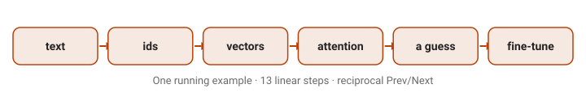
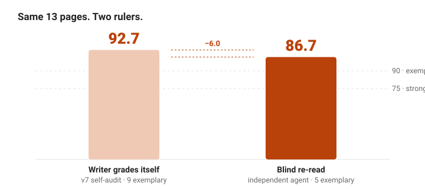
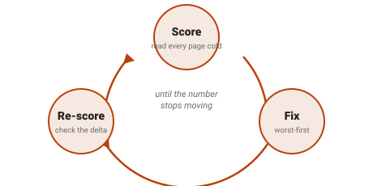

# From Self-Scored to Blind-Reviewed: We Audited Our Own AI Grader

*The course graded itself 92.7. An independent re-read said 86.7 — and the gap is the most honest number in the project*

In our last piece we argued that when an AI agent writes your content, **the method, not the model, is what makes it worth shipping** — a [thirteen-lesson course on how Transformers work](https://fernfant.github.io/mini-pragma/course/html/index.html), held honest by a scoring rubric and a **score→fix→re-score loop**. We ended on a tidy number: 93.2 out of 100, nine pages exemplary, self-scored and "conservative."

Then we did the thing that tidy number was begging for. We tested the loop's weakest link — the part we'd flagged in our own notes and then quietly lived with.

**Who grades the grader?**

Because here is the embarrassing structural fact of the whole setup: the same agent that *wrote* each lesson also *scored* it. It fixed the pacing gaps and then awarded itself the points for closing them. That's not a small caveat. It's the foundation every headline number was standing on. This post is what happened when we kicked it.

## A 60-second recap of the method

If you missed part one: the course is **one linear spine** — text → ids → vectors → attention → a guess → fine-tuning — with the same example carried the whole way, reciprocal pagination so nobody falls off the path, and optional side-quests kept *off* the main route. Structure you can check mechanically, not a table of contents.

Upstream of every lesson sits the real product: a **rubric**. Each page scored **0–5 across twelve weighted rows** (interactivity, concrete-first, accuracy, honesty, accessibility, flow, pacing…), summed to a single number out of 100, with explicit bands. Write the grader before you trust the writer. Then run the loop: read cold, score, fix the worst, re-score, repeat.

It worked well enough that the course *grew* — from thirteen pages to **eighteen**, adding a visual "watch a forward pass happen" series and a full property-portal capstone. The [live scorecard](https://fernfant.github.io/mini-pragma/course/html/scorecard.html) now reads **94.6 average, all eighteen pages exemplary.**

A beautiful scoreboard. Maintained by the same agent that plays the game.

## The blind spot we had already written down

We didn't need an outside critic to find the flaw — we'd documented it ourselves. A framework-review pass had flagged three problems in plain language, and every one pointed the same direction:

- **The scores are self-reported.** The audit note said it outright: *"Self-scored by the implementer, not a blind reviewer."*
- **Three criteria had saturated.** Numeric accuracy scored 5 on 12 of 13 pages, honesty 5 on 11 of 13, narrative 5 on 12 of 13. Together they carry **22 of the 100 points** while contributing almost no variance — they couldn't tell a strong page from an exemplary one.
- **Holistic-then-justify.** An author scoring their own fixes grades intuitively, then back-fills the justification. The number comes first; the reasons get fitted to it.

Inter-rater reliability research has a blunt name for the cure: **separate the scorer from the author.** So we did — we pointed independent read-only agents at all thirteen spine pages and told them to grade blind against the same twelve-row rubric, with no sight of the existing scores.

## Predict before the reveal

We make thirteen-year-olds commit to a guess before showing them the answer. It's the course's signature move — *predict-before-reveal* — and it's only fair we use it on you.

> **🤔 Take the guess.** Thirteen pages the agent had self-scored at **92.7**. Same pages, unchanged. A blind, independent re-read against the identical rubric. Did the average go **up**, **down**, or **stay flat**?
>
> *Don't skim past it. The course makes kids commit; an executive can manage the same.*

If you guessed **down**, you already understand why this post exists.

The blind re-audit came back at **86.7** — six points under the self-score, and the band distribution flipped from nine-exemplary-four-strong to **five exemplary, eight strong**.

## What a stricter reader actually found

Here's the part that matters: the drop was **almost entirely a stricter read, not a content regression.** No page got worse. A reviewer with no stake in the scores simply checked the cited numbers against the companion code — and found machine-verifiable mistakes the self-score had waved through. One example, in full:

> **Worked example — a bug the author graded a 5**
>
> *The page (lesson 4g) said:* "the surprise is that attention's Q/K/V, not the feed-forward, is the single biggest block of parameters."
>
> *The page's own bar chart said:* feed-forward = **4,192 params (37.9%)**, Q/K/V = **3,168 (28.6%)**. The feed-forward is the bigger block. The "surprise" was backwards — and it contradicted the figure printed directly beneath it.
>
> The author had scored that page's accuracy a 5. The blind reader scored it 75 overall and put the inverted claim at the top of the fix list.

It wasn't alone. The streaming-leads capstone claimed **298** leads where the seed-7 script actually yields ~**307**. A bridge lesson defined its colour-coded legend *after* the first place it's used. A "feed-forward is GELU" caption sat on top of code that defaults to ReLU. None of these are catastrophes. All of them are exactly the kind of thing an author re-reading their own work nods straight past — and exactly the kind of thing a fresh reader trips on immediately.

## The agent doesn't get bored. That's still the asset and the risk.

The same week, the loop earned its keep on a job no human would volunteer for. We decided the course's friendly word for a model's learnable values — "knob" — should become the real vocabulary: **weights and biases**. That meant **171 occurrences across more than fifty files** — lessons, glossary, notebooks, Python references, even the text inside SVG diagrams — each one judged in context (a single multiplier became *weight*; an offset, *bias*; a count, *parameters*). The agent did it in one pass and stayed consistent across every file. No human team rewrites fifty files by hand without drift.

That's the asset. The risk is the same sentence read backwards: an agent that never gets bored also never gets *suspicious*. Mid-rename it had cheerfully produced "8 weights + 8 biases = 16 weights" (it's 16 *parameters*) and rewritten a filename inside an image link, quietly breaking the picture. It didn't wrinkle its nose at either — a grep did. **The tirelessness is real; the judgment has to be supplied from outside.** That's the whole case for blind review in one anecdote.

## What this means if you're building with AI

Strip away the Transformers and the thirteen-year-old, and four moves generalise to any team putting AI-generated work in front of real people:

1. **Separate the grader from the writer.** A model that scores its own output will inflate — not from malice, from the same holistic-then-justify bias humans have. A blind pass is the cheapest six points of honesty you'll ever buy.
2. **Watch for saturated criteria.** When a measure scores full marks almost everywhere, it has stopped measuring. Re-cut it or retire it; don't let dead weight pad the total.
3. **Make suspicion mechanical.** If a number can be computed, compute it — every pass. The agent won't doubt a figure that smells wrong, so a check has to.
4. **Let the loop, not the scoreboard, decide done.** A 94.6 you gave yourself is a hypothesis. The blind 86.7 is the next batch of worst-first work.

The model wrote the course. The method made it honest — but only once we stopped letting the writer hold its own report card.

## We graded this post, too

This article is built like one of the lessons it describes: it opened **concrete**, it made you **predict before the reveal**, and — naturally — it gets **graded by a rubric**, the same adapted eleven-criterion card we score every CxAI build-story against.

Scored cold, this post came in at **84 / 100 — Strong**, dragged down by two rows: **Visuals** (one new diagram, two reused) and **Takeaways** (the closing list was generic). We did what the loop says — built the self-vs-blind chart into the centre of the argument, sharpened the four moves into specifics — and re-scored to **90 / 100 — Exemplary.**

> **Worked example — eating our own dog food**
>
> The honest move here would be to note the obvious: **this self-score is itself self-scored.** The whole post argues that a writer grading its own work inflates — and then we grade our own work. So we hold two rows at **4, not 5** with a named residual: *Visuals* (the figures are static; the course earns its top marks with widgets you can drag) and *Flow* (this self-scoring coda is a deliberate meta-detour a strict cold-read would flag). The ceiling stays at 4 because we can still name the fix. Same discipline; same blind spot we just spent a thousand words on. We see it.

## See it for yourself

Don't take our word for it — and especially don't take our self-scores. The whole thing is public; check the marking:

- **[Start the course →](https://fernfant.github.io/mini-pragma/course/html/index.html)** — eighteen steps, "a computer can't read" to a fine-tuned model.
- **[The live scorecard →](https://fernfant.github.io/mini-pragma/course/html/scorecard.html)** — every page's per-criterion scores (the self-scored **94.6** — now go find the blind reader's six points).
- **[The code on GitHub →](https://github.com/fernfant/mini-pragma)** — the rubric, the audit reports (including the blind one), and all eighteen pages.

The number you give yourself is a hope. The number a stranger gives you is the truth. Build the loop that tells them apart.

Stay tuned! CxAI Team
